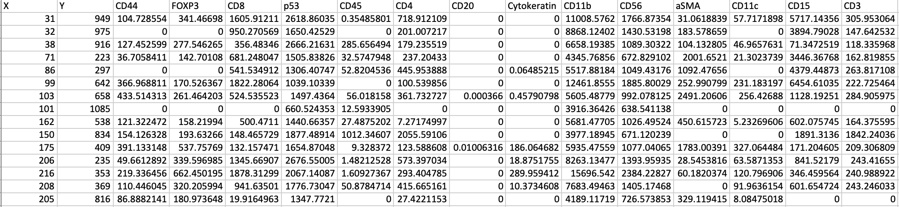
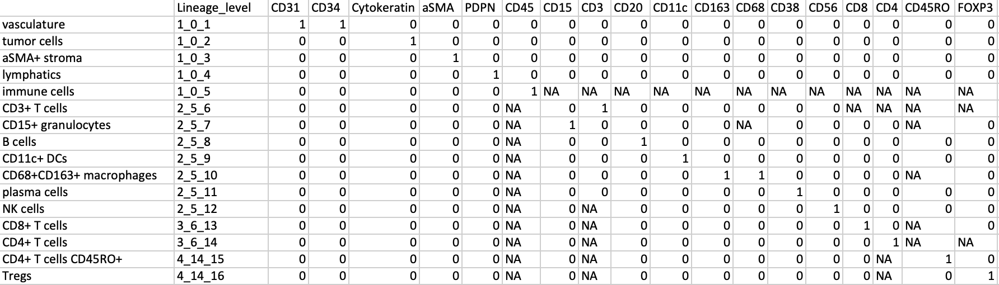
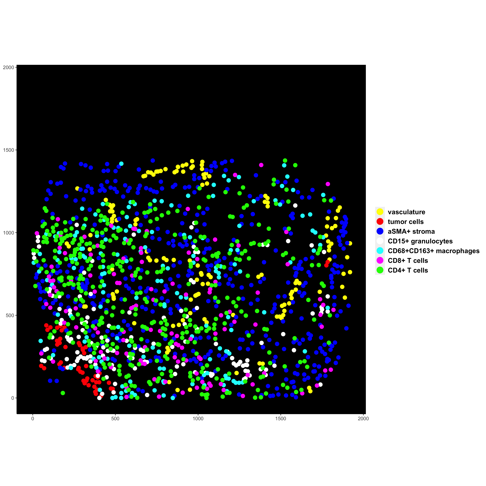
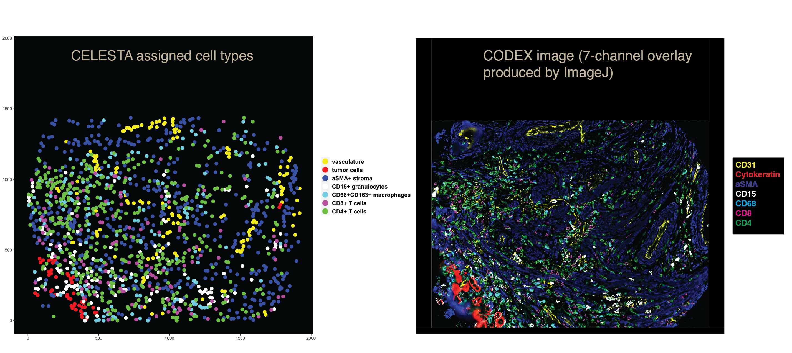
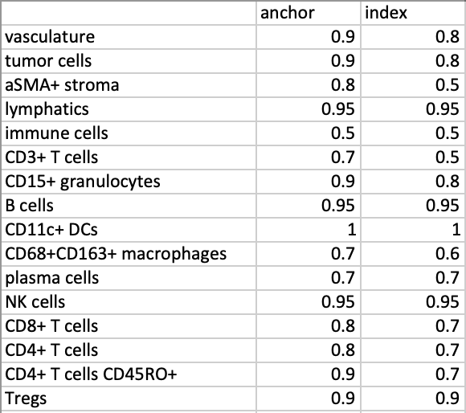
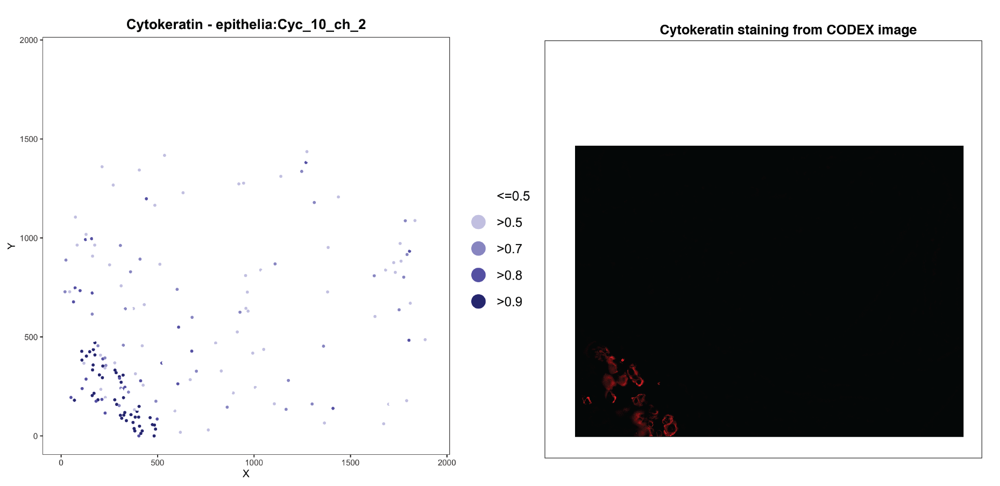
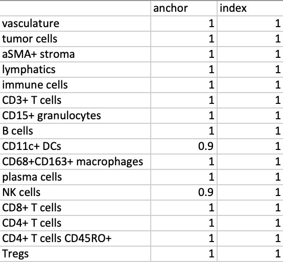

<!-- README.md is generated from README.Rmd. Please edit that file -->

```{r, include = FALSE}
knitr::opts_chunk$set(
  collapse = TRUE,
  comment = "#>",
  fig.path = "man/figures/README-",
  out.width = "100%"
)
options(tibble.print_min = 5, tibble.print_max = 5)
```

# CELESTA

<!-- badges: start -->
<!-- badges: end -->
## Overview
CELESTA (CELl typE identification with SpaTiAl information) is an algorithm aiming to perform automate cell type identification for multiplexed in situ imaging data. CELESTA makes use of both protein expressions and cell spatial neighborhood information from segmented imaging data for the cell type identification. 

The pre-saved imaging data is taken from reg009 of the published CODEX data Schurch et al. Cell,2020 for illustration purpose.

* `CreateCelestaObject` Creates an object running CELESTA. It requires a title to create the project, segmented imaging data file and prior knowledge file for cell-type signature matrix (user-defined).
* `FilterCells()` This step intends to fill out questionable cells due to imaging artifacts, segmentation error etc.
* `PlotExpProb()` This function plots the calculated expression probabilities for each marker included in the user-defined prior cell-type signature matrix. It can be used to visualize and help with setting the thresholds for whether a marker is expressed or not.
* `AssignCells()` This is the main function to assign cell types with an iterative EM algorithm.
* `PlotCellsAnyCombination()` This function can be used to plot the cells with identified cell types with the XY coordinates from segmentation.

## Installation

You can install the development version of CELESTA 

``` {r, eval = FALSE}
# install.packages("devtools")
devtools::install_github("plevritis/CELESTA")
```
## Dependency
CELESTA requires dependency on the following R packages:
- [Rmixmod](https://cran.r-project.org/web/packages/Rmixmod/index.html): for performing Gaussian Mixture Modeling
- [spdep](https://cran.r-project.org/web/packages/spdep/index.html): for obtaining spatial neighborhood information
- [zeallot](https://cran.r-project.org/web/packages/zeallot/index.html): for R code styling. Provides a %<-% operator to perform multiple, unpacking, and destructuring assignment in R. 
- [ggplot2](https://cran.r-project.org/web/packages/ggplot2/index.html)
  [reshape2](https://cran.r-project.org/web/packages/reshape2/index.html): for plotting 

## Usage

```{r,results='hide',message=FALSE}
library(CELESTA)
library(Rmixmod)
library(spdep)
library(ggplot2)
library(reshape2)
library(zeallot)

### The pre-saved imaging data is taken from reg009 of the published CODEX data Schurch et al. Cell,2020
### Create Celesta object. It requires a title for the project. It also required the segmented input file and user-defined cell-type signature matrix.Please refer to the Inputs session below.
CelestaObj <- CreateCelestaObject(project_title = "project_title",prior_marker_info,imaging_data)

### Filter out questionable cells. A cell with every marker having expression probability higher than 0.9 are filtered out. And A cell with every marker having expression probability lower than 0.5 are filtered out. User can define the thresholds based on inspecting their data.
CelestaObj <- FilterCells(CelestaObj,high_marker_threshold=0.9, low_marker_threshold=0.4)

### Assign cell types. max_iteration is used to define the maximum iterations allowed in the EM algorithm per round. 
### cell_change_threshold is a user-defined ending condition for the EM algorithm, for example, 0.01 means that when fewer than 1 percent of the total number of cells do not change identity, the algorithm will stop.
CelestaObj <- AssignCells(CelestaObj,max_iteration=10,cell_change_threshold=0.01,
                          high_marker_threshold_anchor=high_marker_threshold_anchor,
                          low_marker_threshold_anchor=low_marker_threshold_anchor,
                          high_marker_threshold_iteration=high_marker_threshold_iteration,
                          low_marker_threshold_iteration=low_marker_threshold_iteration)

### Plot cells with CELESTA assigned cell types
### It is suggested that do not plot over 7 cell types on the same image for better visualization and compatibility with ImageJ. 
###The cell_number_to_use corresponds to the defined numbers in the prior cell-type signature matrix. For example, 1 corresponds to endothelial cell, 2 corresponds to tumor cell.
PlotCellsAnyCombination(cell_type_assignment_to_plot=CelestaObj@final_cell_type_assignment[,5],
                        coords = CelestaObj@coords,
                        prior_info = prior_marker_info,
                        cell_number_to_use=c(1,2,3),cell_type_colors=c("yellow","red","blue"))

### plot expression probability
PlotExpProb(CelestaObj,save_plot = TRUE)
```

## Inputs
CELESTA requires two inputs:<br/>
`1. Segmented imaging data`: <br/>
a dataframe with rows as the cells, and needs to have (1) two columns named X and Y to define the XY coordinates of the cells and (2) other columns having the protein marker expressions for each cell<br/>

Below is an example of the segmented imaging file header



`2. User-defined cell-type signature matrix`:<br/>
(1) The first column has to contain the cell types to be inferred <br/>
(2) The second column has the lineage information for each cell type. The lineage information has three numbers connected by “_” (underscore). The first number indicates round.Cell types with the same lineage level are inferred at the same round. Increasing number indicates increase cell-type resolution. For example, immune cells -> CD3+ T cells –> CD4+ T cells. The third number is a number assigned to the cell type, i.e, cell type number. The middle number tells the previous lineage cell type number for the current cell type. For example, the middle number for CD3+ T cells is 5, because it is a subtype of immune cells which have cell type number assigned to 5.<br/>
(3) Starting from column three, each column is a protein marker. If the protein marker is known to be expressed for that cell type, then it is denoted by “1”. If the protein marker is known to not express for a cell type, then it is denoted by “0”. If the protein marker is irrelevant or uncertain to express for a cell type, then it is denoted by “NA”.<br/>
(4) More examples of the user-defined cell-type signature matrix is provided under folder:data.<br/>

Below is an example of cell-type signature matrix based on imaging panel used in Schurch et al. Cell, 2020.



## Outputs
CELESTA outputs:
1. The cell types assigned for each round and the final combined cell types in the file with name "final_cell_type_assignment.csv".<br/>
2. The anchor cells defined for each round with name "anchor_cell_assignment.csv".<br/>

CELESTA can also plot the assigned cells by using the plot_cells_any_combination() function. An example output image is shown below: 

Users can compare the output with the original images. An example is shown below:<br/>
`Please note:` CODEX images preprocess with Akoya Biosciences software stitched the image tiles in a flipped way. So in some cases, for the comparisons, the image needs to be flipped.<br/>


## How to define thresholds
In the assign_cell_main( ) function, it requires four vectors to define the high and low thresholds for each cell type. The length of the vector equals to the total number of cell types defined in the cell-type signature matrix.Examples of the thresholds are provided under the folder:data.<br/>
We would suggest start with the default thresholds and modify them by comparing the results with the original staining demonstrated below.<br/>
The two vectors are required for defining the "high_marker_threshold", one for anchor cells and one for index cells. The thresholds defined how much the marker expression probability is in order to be considered as expressed. An example for defining high_marker_threshold is shown below:

<br/>
To find the proper threshold, the plot_exp_prob( ) function can be applied. Because the segmented data may have some compensation in the values which are the inputs to CELESTA, the expression probabilities are calculated based on the segmented data. It's useful to compare the expression probabilities with the CODEX staining for each marker.<br/>
For example, for endothelial cells, if we plot the expression probabilities of CD31 (left) and compare with the CD31 staining, approximately 0.9 and 0.8 would be the right threshold for defining how much the cell should express CD31. `Please note:` It is suggested that for anchor cells, use a slightly higher threshold than index cells.

Another example, for tumor cells, if we plot the expression probabilities of Cytokerain (left) and compare with the Cytokeratin staining, approximately 0.9 and 0.8 would be the right threshold for defining how much the cell should express Cytokeratin. `Please note:` It is suggested that for anchor cells, use a slightly higher threshold than index cells.


The two vectors are required for defining the "low_marker_threshold", one for anchor cells and one for index cells. The thresholds defined how much the marker expression probability is in order to be considered as not expressed. Normally 1 is assigned to this value unless there are a lot of doublets or co-staining in the data.An example for defining low_marker_threshold is shown below:<br/>


## Getting help
If you encounter a clear bug, please file an issue with a minimal reproducible example on [GitHub](https://github.com/plevritis/CELESTA/issues). For questions and other discussion, please use [community.rstudio.com](https://community.rstudio.com/). 
